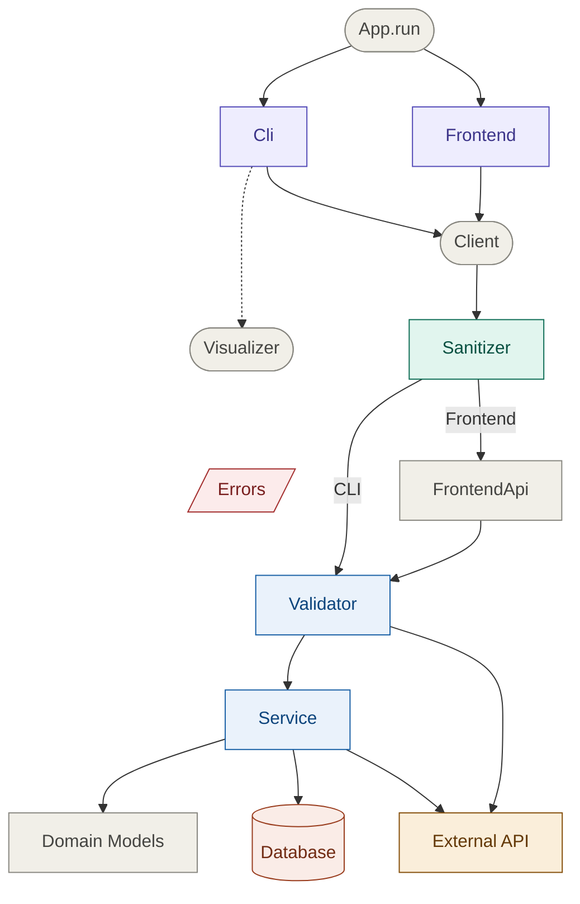
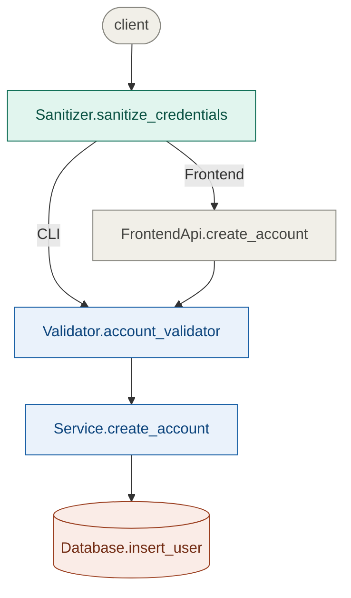
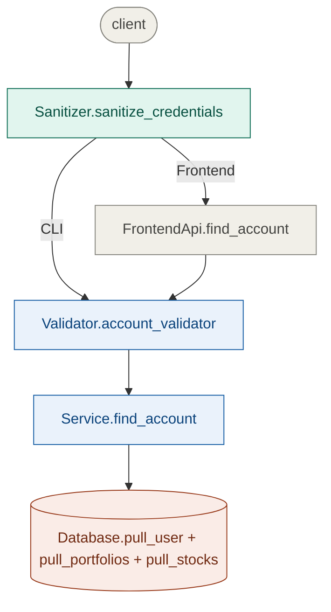
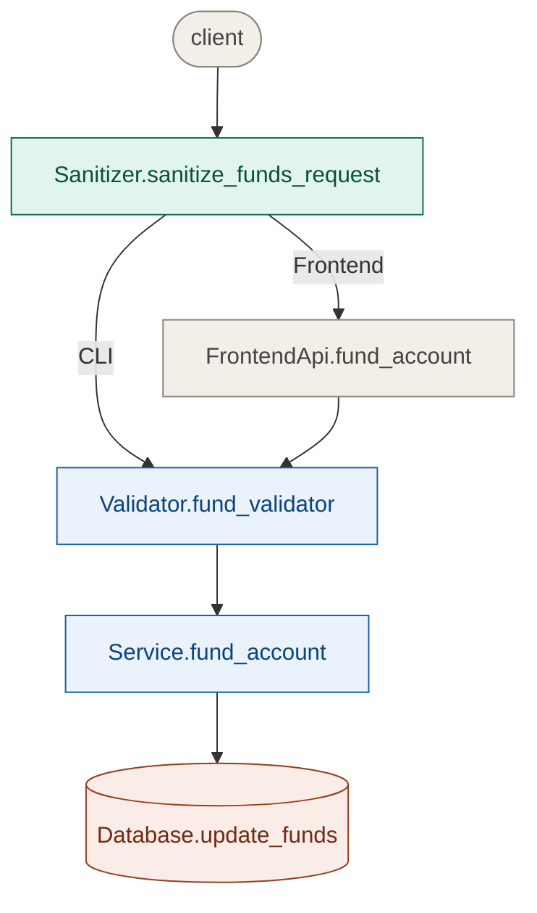
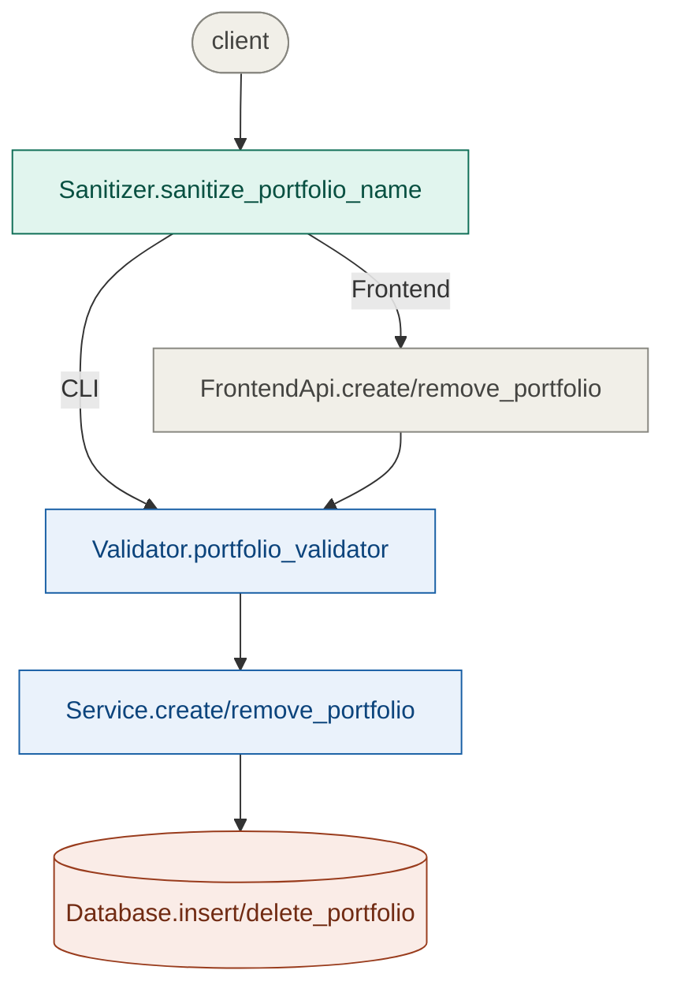
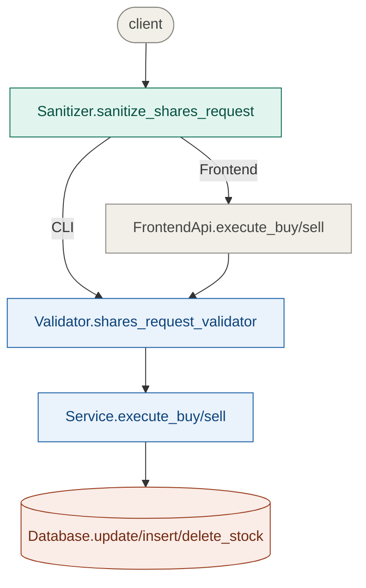

# System Architecture


# Feature Pipelines

Core feature pipelines with traversal through layers and main method calls excluding helper functions.

---

## Create Account


## Find Account


## Fund Account


## Create/Remove Portfolio


## Execute Buy/Sell


# Program Documentation Guidelines

Fields marked **"if N/A – None"** must still appear with the literal value `None` so readers know the field was considered.

---

## Classes
```python
# PURPOSE:
#    - <ClassName> provides <X> abstraction
#    - <why the abstraction exists>
```

## Functions
```python
# INPUT: if N/A - None
#    - <param_name>(type); <what it represents>
# OUTPUT: if N/A - None
#    - <var_name>(type); <what it represents>
# PRECONDITION: if N/A - None
#    - <param_name or state>; <value constraint>
# POSTCONDITION: if N/A - None
#    - <param or state>; <observable guarantee after return>
# RAISES: if N/A - None
#    - <ExceptionType>; <condition that triggers it>
def function_name(param_name: type) -> type:
    return var_name
```

---

## Style Rules

| Rule | Description |
|---|---|
| **Semicolons** | Separate name/type from description with `"; "` |
| **Indentation** | Labels flush-left; entries indented with TAB |
| **Types** | Use Python builtins or `typing` module. Project-defined types listed in [Types](#types) below. Persistent types carry `id` (database primary key). Nested collections may be abbreviated in higher layers when element types are defined in a referenced `POSTCONDITION`. |
| **Constraints** | State value constraints, not types — `n > 0` not `"must be int"` |
| **Guarantees** | Describe observable state, not implementation details |
| **Be brief** | Short phrase per entry, not full sentences |

---

# Program Models

## Types

| Type | Description |
|---|---|
| `User` | Represents a user account; holds login, balance, and a collection of portfolios |
| `Portfolio` | Represents a named collection of stocks |
| `Stock` | Represents a stock holding; ticker and quantity |

---

## Request Models

JSON request bodies sent to the Frontend API.

**LogoutRequest**
```json
{
    "session_id": "string"
}
```

**CredsRequest**
```json
{
    "login": "string",
    "password": "string"
}
```

**FundsRequest**
```json
{
    "session_id": "string",
    "funds_requested": 0.00
}
```

**PortfolioRequest**
```json
{
    "session_id": "string",
    "name": "string"
}
```

**TransactionRequest**
```json
{
    "session_id": "string",
    "portfolio_name": "string",
    "ticker": "string",
    "quantity": 0
}
```

---

## Response Models

JSON response bodies returned by the Frontend API.

**StockData**
```json
{
    "ticker": "AAPL",
    "quantity": 4
}
```

**PortfolioData**
```json
{
    "name": "tech",
    "stocks": {
        "AAPL": { }
    }
}
```
> `stocks` values follow the `StockData` schema above.

**UserData**
```json
{
    "login": "john_doe",
    "balance": 1000.00,
    "portfolios": {
        "tech": { }
    }
}
```
> `portfolios` values follow the `PortfolioData` schema above.