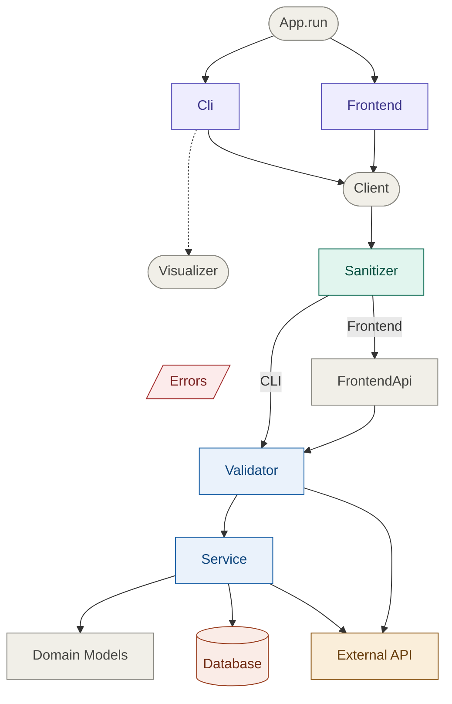
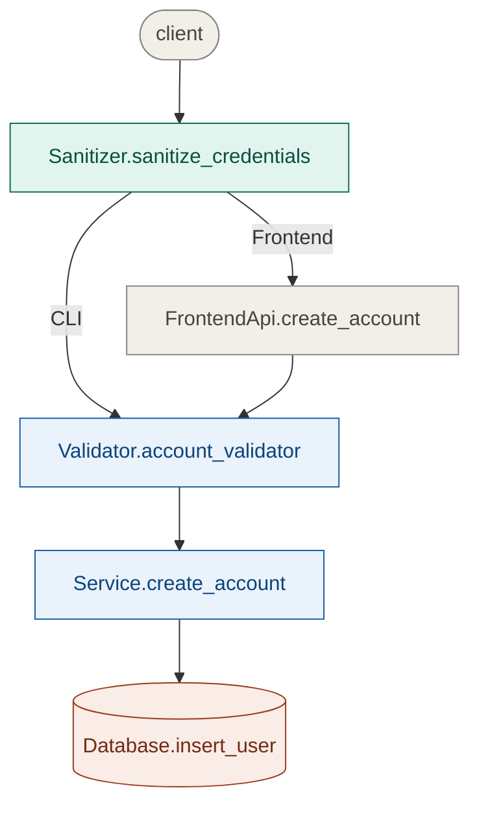
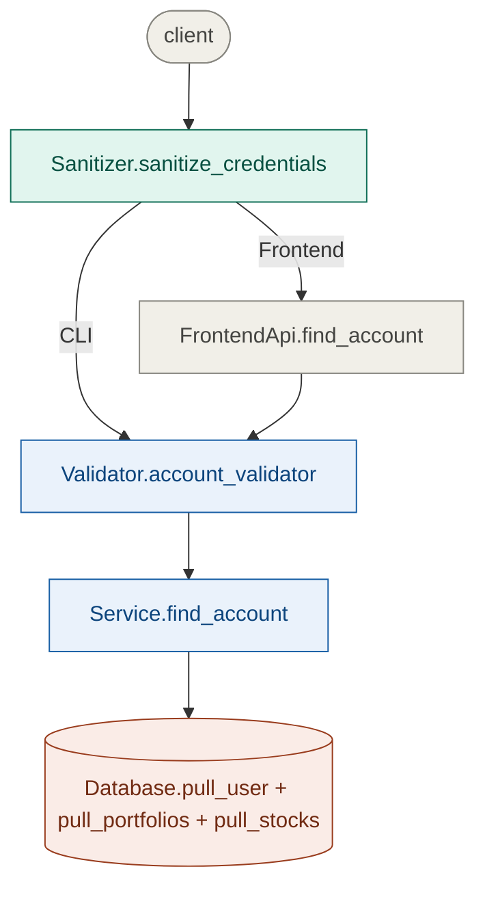
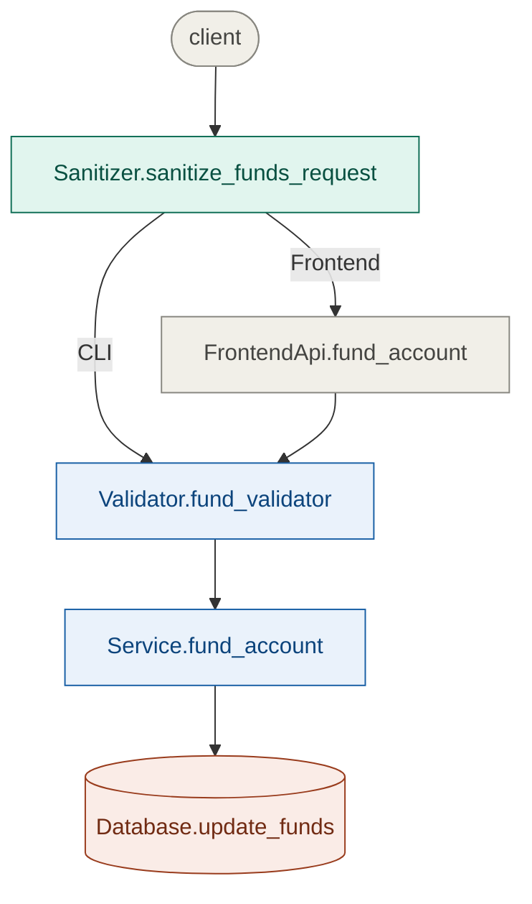
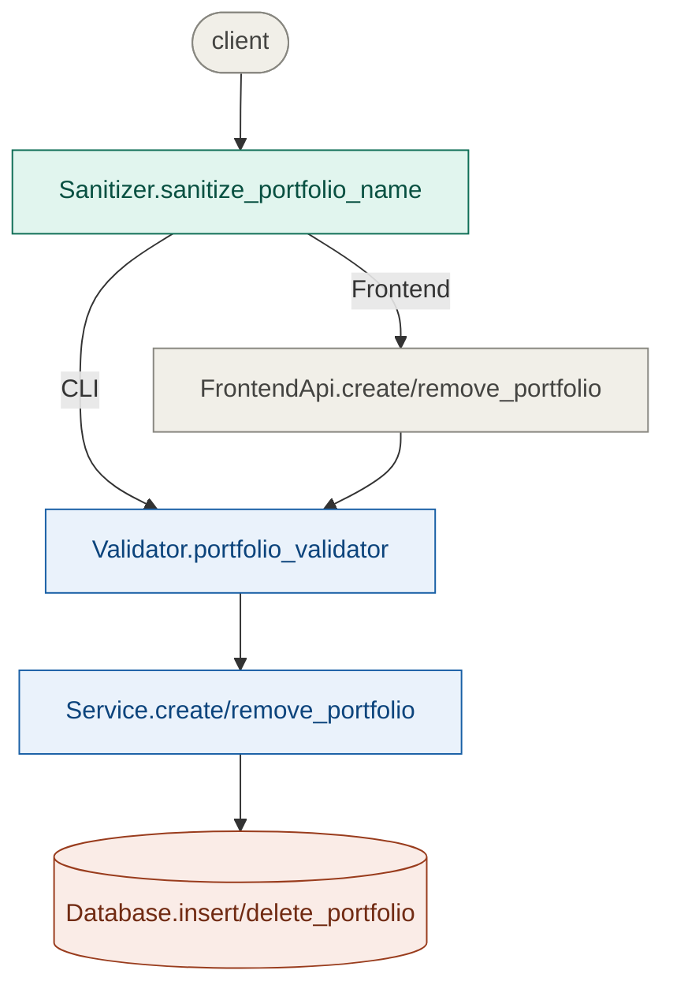
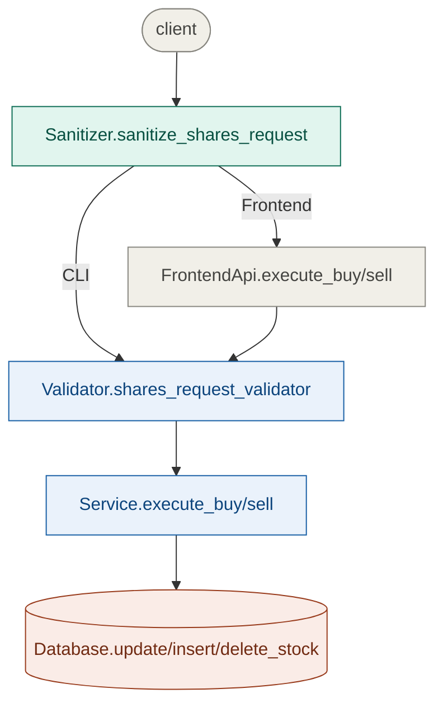

# System Architecture

# Feature Piplines

Core feature pipelines with traversal through layers and main method calls excluding helper functions.

---

## Create Account

## Find Account

## Fund Account

## Create/Remove Portfolio

## Execute Buy/Sell

